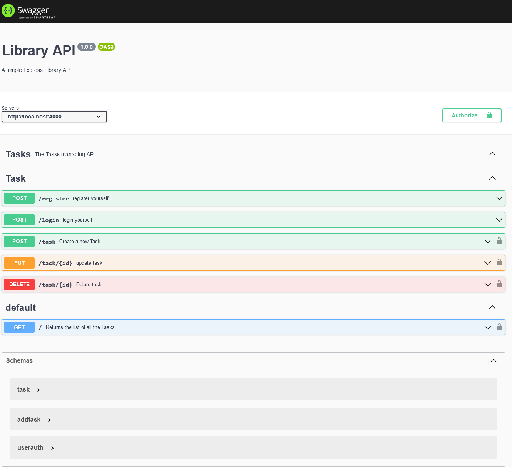
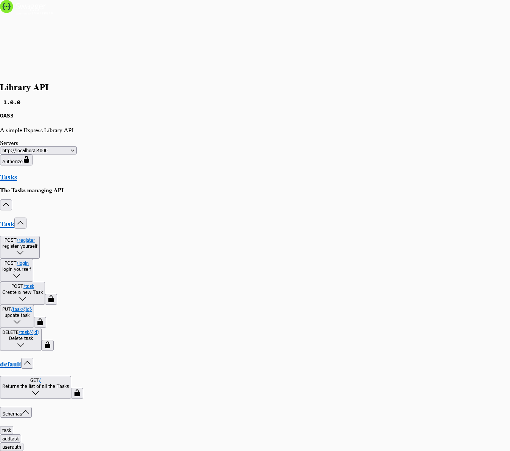

# CRUD Api App
  - visit api [https://oyestercrud.vercel.app/](https://oyestercrud.vercel.app/)
## Routes

- / - home page list all the tasks
- *post* /task - add task to list 
- *put* /task/:id - update the specified task
- *delete* /task/:id-  delete the specified task
- /api-docs - route for swagger ui

## results

### Local 
  It is the result to my local environment 
  

###
 Production deployment result
 